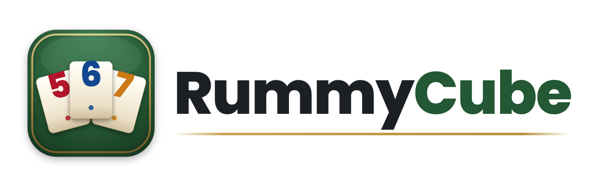
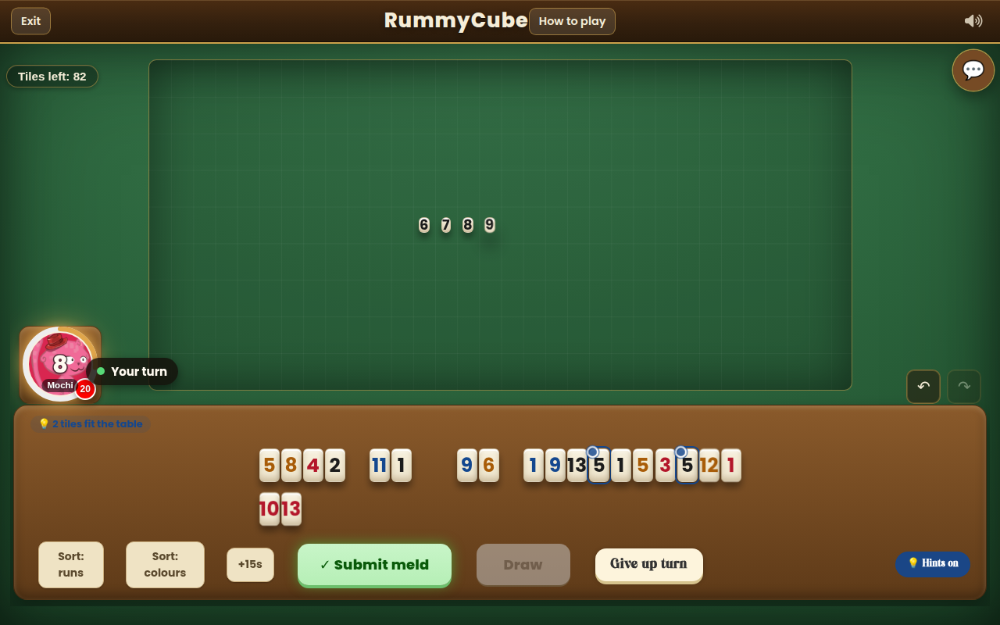
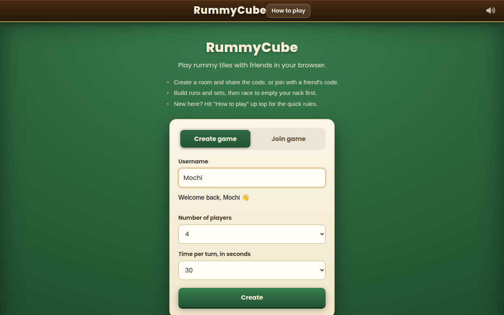
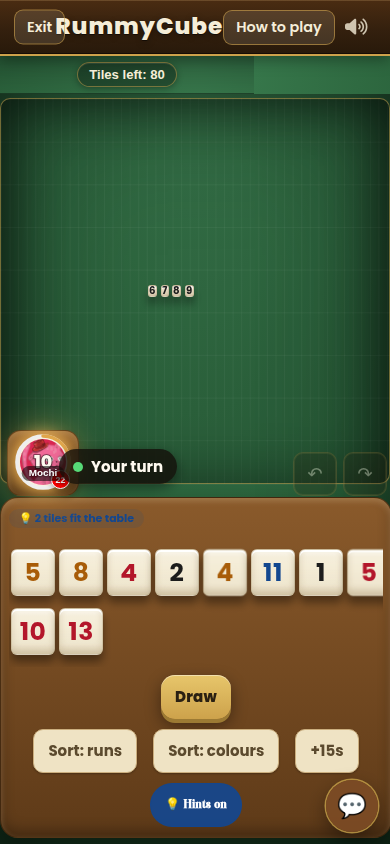

<div align="center">



### Online multiplayer rummy tiles — play with friends in your browser

<a href="https://game.shunlyu.com"></a>
<a href="https://github.com/sinmentis/rummycube/actions/workflows/ci.yml"></a>
<a href="LICENSE"></a>


</div>

---

**RummyCube** is a real-time, online multiplayer rummy-tiles game (Rummikub-style) for 2–4 players.
Create a room, share the link, and play in the browser on desktop or phone — no install, no account, just a nickname.

<div align="center">

</div>

## Features

- **Real-time multiplayer** for 2–4 players over WebSocket — moves sync instantly. No accounts: share a room link or code, pick a nickname, play.
- **Self-tidying board** — drop your tiles and the table reorganizes itself; runs and groups snap into place, so you arrange the game, not the pixels.
- **Fits any screen** — the whole board stays in view on desktop or phone, no scrolling, with your rack always pinned in reach.
- **Mouse and touch** — drag-and-drop everywhere, plus tap-to-multiselect to move a whole set at once.
- **Polished and juicy** — green felt, ivory beveled tiles, a wooden rack; tiles lift, settle and pop, with sound and a mute toggle.
- **Quick chat** — speech bubbles pop from each player's seat.
- **Fair play, built in** — the server owns the rules and the turn clock, and a refresh or dropped connection drops you right back into your seat.
- **Solo test mode** — try the whole thing on your own, no second player needed.

## How to play

Each player starts with 14 tiles on a private rack. On your turn, build **sets** on the shared table:

- a **run** — three or more consecutive numbers of the same colour (e.g. blue 5 6 7), or
- a **group** — the same number in different colours (e.g. red 9, black 9, orange 9).

Your **first meld must total at least 30 points** from your own tiles. After that you may rearrange any tiles already on the table to make new sets. Jokers are wild. The first player to empty their rack wins.

## Plays everywhere

<table>
<tr>
<td width="62%"></td>
<td align="center"></td>
</tr>
</table>

## Tech stack

| Area | Tech |
|---|---|
| Frontend | React 18 + Vite, [@dnd-kit](https://dndkit.com) (drag), CSS animations, canvas-confetti, Web Audio |
| Game / multiplayer | [boardgame.io](https://boardgame.io) — authoritative game state + WebSocket transport |
| Hosting | rootless Podman container behind a Cloudflare Tunnel |

## Local development

Requires Node 22+.

```shell
cp .env.example .env   # adjust values if needed
npm install
npm start              # frontend (Vite dev server)
npm run serve          # dev backend server
```

Run the test suite:

```shell
npm test
```

## Self-host

One container runs everything — the boardgame.io server and the built
frontend on a single port (`9119`):

```shell
cp .env.example .env.production   # point REACT_APP_SERVER_* at your host
docker build -t rummycube .
docker run -p 9119:9119 rummycube
```

Then open `http://localhost:9119`. The live demo at
[game.shunlyu.com](https://game.shunlyu.com) runs this exact image as a
rootless Podman container behind a Cloudflare Tunnel.

## Solo test mode

Want to see the game without a second browser? In the create-game form, pick
**"0 · solo test"** as the number of players — it starts a real single-player
match you can play on your own.

## Credits

Bootstrapped from [ilov3/rummikub](https://github.com/ilov3/rummikub). Thanks to the original author.

Player cat avatars are generated with [RoboHash](https://robohash.org) (set4 "Cats" by [David Revoy](https://www.peppercarrot.com/extras/html/2016_cat-generator/), licensed [CC-BY-4.0](https://creativecommons.org/licenses/by/4.0/)).

## License

Released under the MIT License — see [`LICENSE`](LICENSE).
